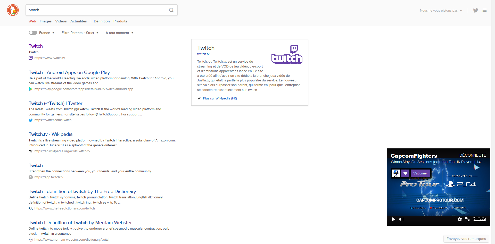

# Sidetwitch
SideTwitch is a browser extension working on Mozilla Firefox and Google Chrome browsers.
This extension allows you to embbed an iframe containing a live twitch channel into your tabs. This iframe can be moved around in your tab (size, position) and follows you as you switch tabs. 

## How to
Using the extension is really simple. In your tool bar a new icon will appear after the installation.

Click  and fill the form by entering the channel name.
Your stream should then appear in the bottom right of your tab.

When you move your mouse above the iframe, some contextual actions are available:
- You can resize the window by grabbing the top left corner
- You can close the window by clicking 
- You can drag the window by grabbing 

You can also toggle the iframe display by using the keybinding "Alt+Shift+T".

## Bugs
Do not hesitate to submit an issue [in github](https://github.com/nugetchar/sidetwitch) if you find any bug.

Notes : some website don't allow iframe embedding (i.e: github), this isn't something we can fix :)